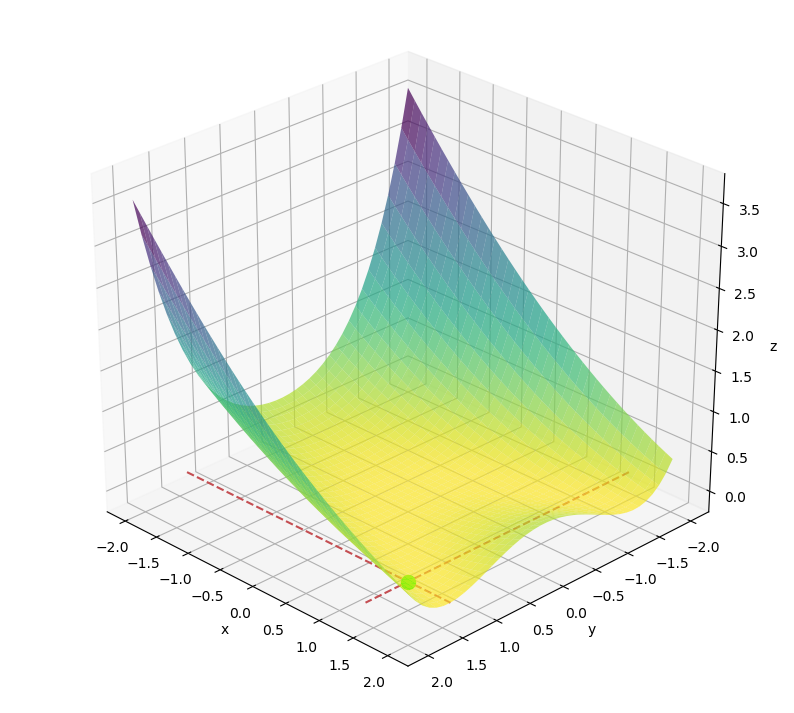
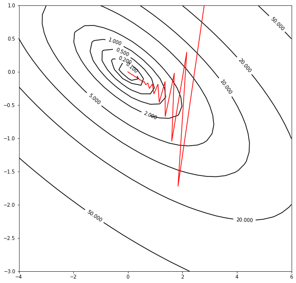
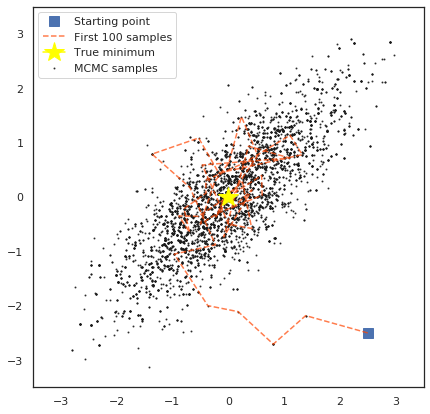

This repository contains some of my personal projects regarding optimization problems. Some algorithms I have built from scratch are gradient descent, the Metropolis-Hastings jumping rule for Markov chain Monte Carlo, and a Gaussian Process Emulator using a squared exponential distance kernel.

<tr>
    <td> 
         </td>
    <td> 
        
    </td>
    <td> 
        
    </td>
</tr>
